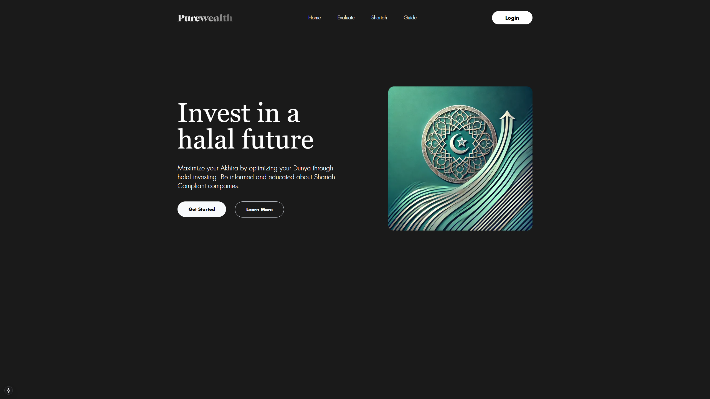
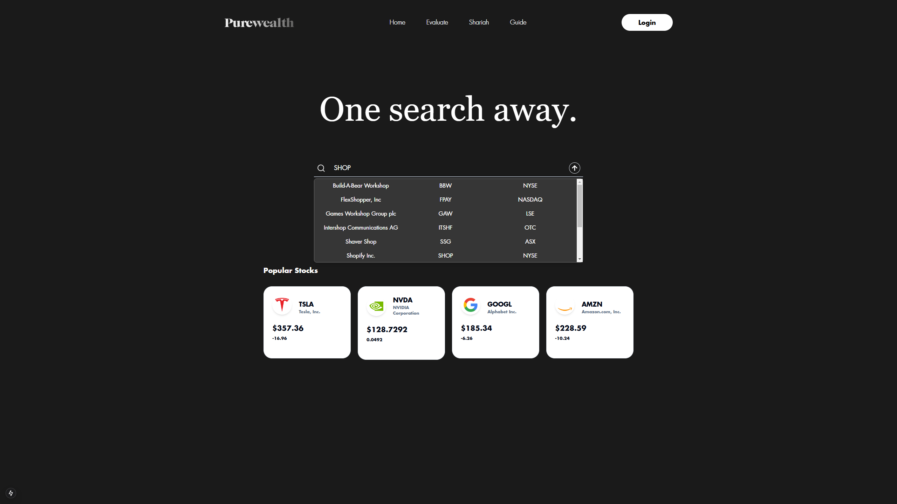
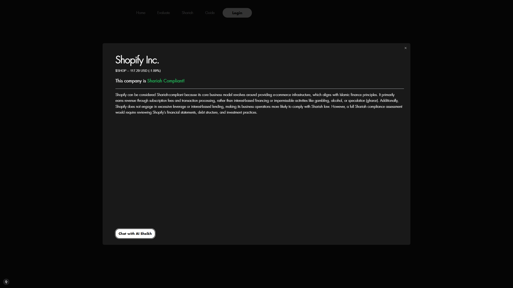

# Purewealth

#### Disclaimer: The main repository will not be made open source.

## Overview

In a world where responsible investing is more important than ever, **Purewealth** emerges as a transformative solution. With an increasing demand for Shariah-compliant financial services, and a surge in investors seeking to align their portfolios with their values, Purewealth brings efficiency and clarity to the evaluation process. Our ultimate mission? To democratize financial knowledge and **bring Islamic Finance to the forefront**.

## Why Purewealth?

- **Speed & Automation**: Eliminates hours of manual work by automatically analyzing a company's financial data and public communications.
- **Accurate & Comprehensive**: Takes data from multiple sources, ensuring a thorough 360° look.
- **LLM-Powered**: Utilizes advanced natural language processing to interpret and evaluate companies using **S&P Global’s Shariah Compliance Framework**.
- **Highly Scalable**: Deployable across various sectors, opening pathways to more inclusive and broad-based Islamic financial products.

> A 3000% time reduction, delivering deeper insights in **minutes**.

## Background

More and more Muslims—and ethically conscious investors in general—are seeking financial solutions that are in alignment with **responsible corporate behavior** and **Shariah principles**. While many financial institutions have laid out solid frameworks for Shariah compliance, the evaluation process remains largely manual, time-consuming, and prone to errors. **Purewealth** aims to simplify this.

## How It Works

1. **Frontend**: Users interact with an intuitive Next.js/React interface, searching for or selecting a company to evaluate.
2. **Evaluation Controller**: Receives the user’s request and orchestrates the process.
3. **Scraper Service**: Collects key data from multiple sources, including:
   - Financial statements
   - Public reports & stakeholder communications
   - Structured and unstructured data sets
4. **Natural Language Processing**: Cleans and standardizes the scraped data.
5. **LLM Analysis**:
   - Feeds the structured data to the **fine-tuned Deepseek model API**.
   - The model applies **S&P Global’s Shariah Compliance Framework** to determine if a company meets Shariah standards.
6. **Results & Storage**: The LLM evaluation is returned to the Evaluation Controller, displayed to the user, and stored in **MongoDB** for future reference.

## Technologies Used

- **Frontend**: Next.js / React (TypeScript, JavaScript, CSS)
- **Backend**: Python (Flask/FastAPI, etc.)
- **Database**: MongoDB
- **LLM**: Deepseek API (fine-tuned in-house)
- **Infrastructure**: Docker
- **Version Control**: Git

## Next Steps

- **Expand Shariah Criteria**: Broaden the scope of evaluation to include more intricate facets of Islamic finance.
- **Refine NLP Pipelines**: Improve accuracy in data extraction and structure.
- **Enhanced User Interface**: Make data visualization more intuitive and interactive.
- **Integration with Other Frameworks**: Incorporate additional ethical investing criteria.

## Contributors

We’d like to thank everyone who has contributed to this project:

- [**Arham Ansari**](#)
- [**Sufyan Khan**](#)
- [**Rakhshan Khan**](#)
- [**Zaid Okal**](#)

## Images

**Purewealth**: Accelerating the dawn of ethical and Shariah-based investing, one company at a time.
